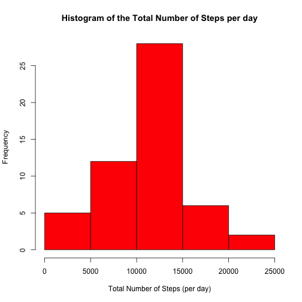
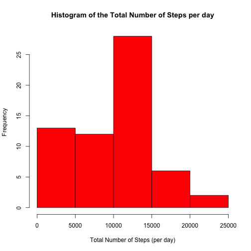

# Reproducible Research: Peer Assessment 1

## Loading and preprocessing the data

```r
echo = TRUE
data = read.csv("activity.csv", header = TRUE)
step <- as.numeric(as.character(data[, 1]))
intv <- as.numeric(as.character(data[(2:289), 3]))
totalstep <- 0
newstep <- matrix(0, nrow = 288, ncol = 61)
for (i in 1:61) {
    newstep[, i] <- as.numeric(as.character(data[((288 * (i - 1) + 1):(i * 288)), 
        1]))
    totalstep[i] <- sum(newstep[, i])
}
```


## What is mean total number of steps taken per day?

```r
hist(totalstep, col = "red", main = "Histogram of the Total Number of Steps per day", 
    xlab = "Total Number of Steps (per day)", ylab = "Frequency")
```

 

```r
mean(na.omit(totalstep))  #the mean total number of steps taken per day
```

```
## [1] 10766
```

```r
median(na.omit(totalstep))  #the median total number of steps taken per day
```

```
## [1] 10765
```


## What is the average daily activity pattern?

```r
avgstep <- 0
for (i in 1:288) {
    avgstep[i] <- mean(na.omit(newstep[i, ]))
}
plot(intv, avgstep, type = "l", main = "Average Number of Steps per day", xlab = "Interval", 
    ylab = "Average Steps")
```

 

Which 5-minute interval, on average across all the days in the dataset, contains the maximum number of steps?
 --> The 900 Interval according to the plot, which roughly corresponds to mornings 9am.
 
 
## Imputing missing 
1 - Calculate and report the total number of missing values in the dataset (i.e. the total number of rows with NAs):

```r
sum(!is.na(step))
```

```
## [1] 15264
```

2 - Devise a strategy for filling in all of the missing values in the dataset. The strategy does not need to be sophisticated. For example, you could use the mean/median for that day, or the mean for that 5-minute interval, etc.

The startegy adopted for this excercie is to consider the NA values as a 0 step.

```r
newstep1 <- newstep
totalstep1 <- 0
newstep1[is.na(newstep1)] <- 0
for (i in 1:61) {
    totalstep1[i] <- sum(newstep1[, i])
}

hist(totalstep1, col = "red", main = "Histogram of the Total Number of Steps per day", 
    xlab = "Total Number of Steps (per day)", ylab = "Frequency")
```

 

```r
mean(totalstep1)  #the mean total number of steps taken per day
```

```
## [1] 9354
```

```r
median(totalstep1)  #the median total number of steps taken per day
```

```
## [1] 10395
```

The values of the mean and the median of the total daily number of steps are a little shifted toward lower values compared to the first numbers after imputting the missing data, which is expected since 
missing data, in most cases, introduce small deviations from the real values.

## Are there differences in activity patterns between weekdays and weekends?

```r
datte <- as.POSIXct(paste(as.character(data[, 2])), format = "%Y-%m-%d")
class(weekdays((datte[2]), abbreviate = T))
```

```
## [1] "character"
```

```r
weekstep <- matrix(0, nrow = 288, ncol = 47)
weeknd <- matrix(0, nrow = 288, ncol = 16)
newstep2 <- newstep1
totalstep2 <- 0

for (i in 1:61) {
    newstep2[, i] <- as.numeric(as.character(data[((288 * (i - 1) + 1):(i * 
        288)), 1]))
    if (weekdays(as.POSIXct(paste(as.character(data[(i * 288), 2])), format = "%Y-%m-%d"), 
        abbreviate = T) == as.character("Sat") | weekdays(as.POSIXct(paste(as.character(data[(i * 
        288), 2])), format = "%Y-%m-%d"), abbreviate = T) == as.character("Sun")) {
        weeknd[, i] <- newstep2[, i]
    } else {
        weekstep[, i] <- newstep2[, i]
    }
}
```

```
## Error: subscript out of bounds
```

```r
avgweek <- 0
avgwknd <- 0
for (i in 1:288) {
    avgweek[i] <- mean(na.omit(weekstep[i, ]))
    avgwknd[i] <- mean(na.omit(weeknd[i, ]))
}
par(mfrow = c(2, 1))
# Plot1
plot(intv, avgweek, type = "l", main = "Average Number of Steps per Week day", 
    xlab = "Interval", ylab = "Average Steps")

# Plot2
plot(intv, avgstep, type = "l", main = "Average Number of Steps per Weekend day", 
    xlab = "Interval", ylab = "Average Steps")
```

 

